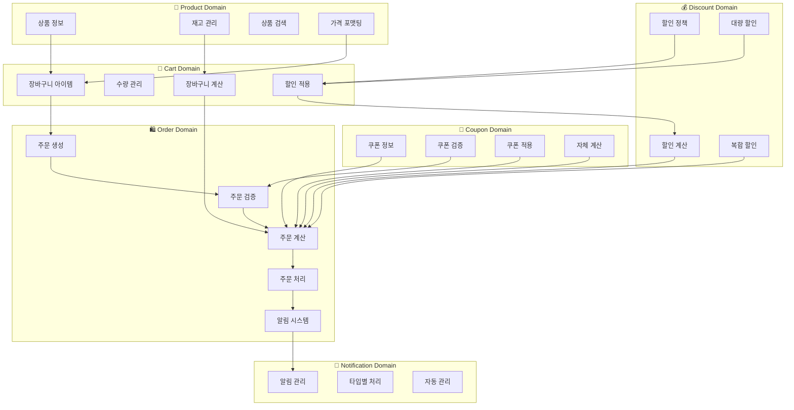
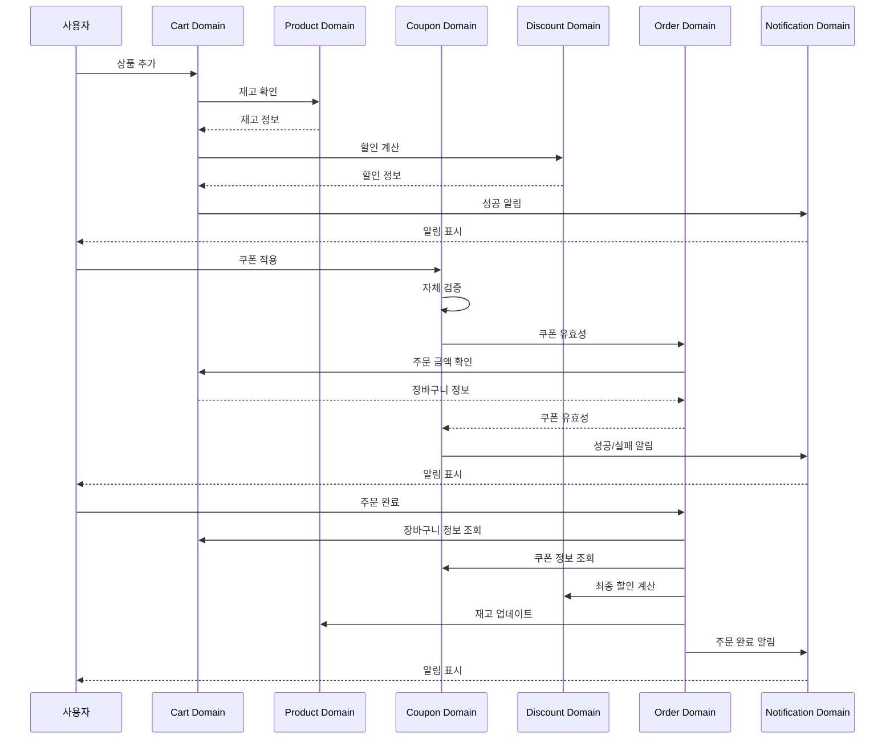
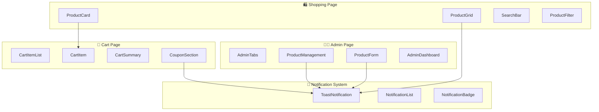
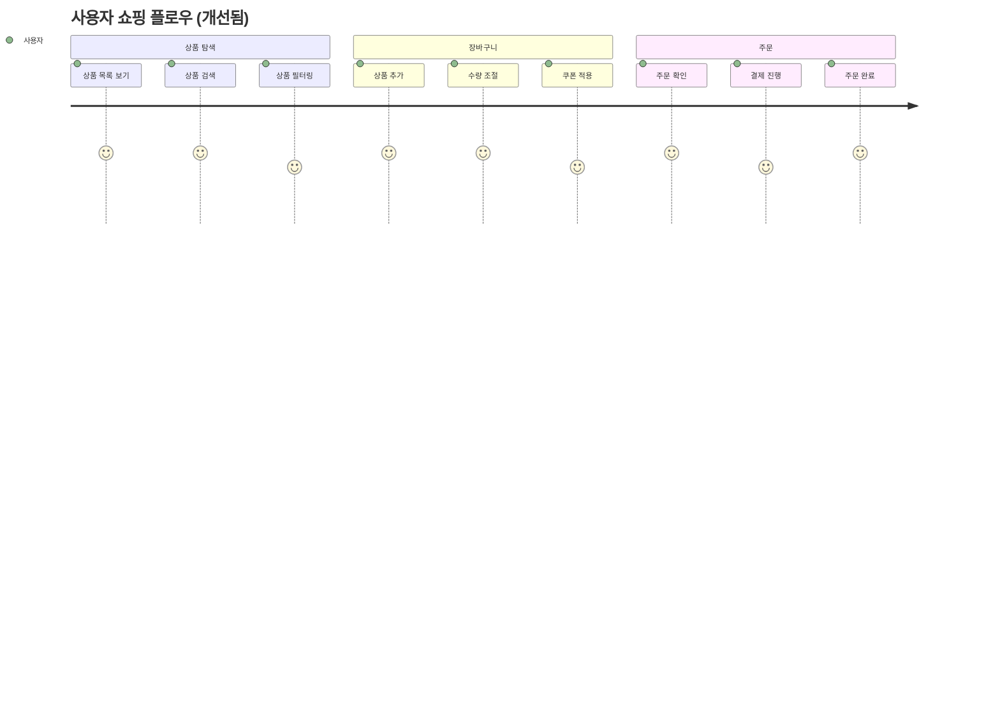

# 바운디드 컨텍스트 분석 (업데이트됨)

## 🎯 현재 코드의 바운디드 컨텍스트 구조

현재 프로젝트를 분석한 결과, 다음과 같은 바운디드 컨텍스트들이 **성공적으로 구현**되었습니다:

## 🏗️ 구현된 바운디드 컨텍스트

### 1. 🛒 **장바구니(Cart) 바운디드 컨텍스트** ✅ 완료

#### 📁 위치:

- `src/basic/models/cart.ts` - 도메인 모델
- `src/basic/store/use-cart-store.ts` - 상태 관리
- `src/basic/services/use-cart-service.ts` - 비즈니스 로직

#### 🎯 책임

```typescript
// 장바구니 도메인 모델 (순수 함수)
interface CartDomain {
  // 장바구니 아이템 관리
  addItem(product: Product, quantity: number): CartItem;
  removeItem(productId: string): void;
  updateQuantity(productId: string, quantity: number): void;

  // 장바구니 계산
  calculateItemTotal(item: CartItem): number;
  getMaxApplicableDiscount(item: CartItem): number;

  // 장바구니 상태 관리
  getCart(): CartItem[];
  clearCart(): void;
}
```

#### 🔧 구현된 기능

- ✅ 장바구니 아이템 추가/제거 (`addCartItems`, `removeCartItemByProductId`)
- ✅ 수량 조절 (`updateQuantity`)
- ✅ 장바구니 계산 로직 (`calculateCartTotal`)
- ✅ 할인 적용 로직 (`calculateItemDiscounts`)
- ✅ localStorage 영속성
- ✅ 재고 검증 로직 (`validateCartItemQuantity`)
- ✅ 순환 의존성 제거

#### 🚀 개선사항

- ✅ **명확한 네이밍**: `addCartItems`, `findCartItemByProductId`, `clearCart`
- ✅ **서비스 레이어 분리**: 비즈니스 로직을 `use-cart-service.ts`로 캡슐화
- ✅ **재사용성**: 다른 페이지에서도 독립적으로 사용 가능

### 2. 🏪 **상품(Product) 바운디드 컨텍스트** ✅ 완료

#### �� 위치:

- `src/basic/models/product.ts` - 도메인 모델
- `src/basic/store/use-product-store.ts` - 상태 관리
- `src/basic/services/use-product-service.ts` - 비즈니스 로직

#### 🎯 책임

```typescript
// 상품 도메인 모델
interface ProductDomain {
  // 상품 정보 관리
  createProduct(product: ProductView): Product;
  updateProduct(id: string, updates: Partial<ProductView>): Product;
  deleteProduct(id: string): void;

  // 상품 검색
  searchProducts(query: string): Product[];
  getProducts(): Product[];

  // 재고 관리
  checkStock(productId: string): number;
  updateStock(productId: string, quantity: number): void;
}
```

#### 🔧 구현된 기능

- ✅ 상품 CRUD (`addProduct`, `updateProduct`, `removeProductById`)
- ✅ 상품 목록 관리
- ✅ 상품 검색 및 필터링 (`filterProducts`)
- ✅ 가격 포맷팅 (`formatPrice`)
- ✅ localStorage 영속성

#### 🚀 개선사항

- ✅ **일관된 네이밍**: `addProduct`, `findProductById`, `updateProduct`
- ✅ **검색 로직 분리**: `use-product-service.ts`에서 필터링 로직 캡슐화
- ✅ **가격 포맷팅**: 재고 상태에 따른 동적 가격 표시

### 3. 🎫 **쿠폰(Coupon) 바운디드 컨텍스트** ✅ 완료

#### 📁 위치:

- `src/basic/models/coupon.ts` - 도메인 모델
- `src/basic/store/use-coupon-store.ts` - 상태 관리
- `src/basic/services/use-coupon-service.ts` - 비즈니스 로직

#### 🎯 책임

```typescript
// 쿠폰 도메인 모델
interface CouponDomain {
  // 쿠폰 관리
  createCoupon(coupon: Coupon): Coupon;
  deleteCoupon(code: string): void;

  // 쿠폰 검증
  validateCoupon(coupon: Coupon, order: Order): boolean;
  checkCouponEligibility(coupon: Coupon, order: Order): boolean;

  // 쿠폰 적용
  applyCoupon(coupon: Coupon, order: Order): Order;
  removeCoupon(order: Order): Order;
}
```

#### 🔧 구현된 기능

- ✅ 쿠폰 CRUD (`addCoupon`, `removeCouponByCode`)
- ✅ 쿠폰 적용 로직 (`applyCouponToCart`)
- ✅ 쿠폰 검증 로직 (`validateCouponEligibility`)
- ✅ 자체 총액 계산 (`calculateTotalWithCouponDiscount`)
- ✅ localStorage 영속성

#### 🚀 개선사항

- ✅ **순환 의존성 완전 해결**: 외부 의존성 없이 자체 계산
- ✅ **실시간 검증**: 쿠폰 적용 시 즉시 유효성 검증
- ✅ **명확한 네이밍**: `applyCouponToCart`, `validateCouponEligibility`

### 4. 💰 **할인(Discount) 바운디드 컨텍스트** ✅ 완료

#### 📁 위치:

- `src/basic/models/discount.ts` - 도메인 모델
- `src/basic/models/cart.ts` - 할인 계산 로직

#### 🎯 책임

```typescript
// 할인 도메인 모델
interface DiscountDomain {
  // 할인 정책 관리
  createDiscountPolicy(policy: DiscountPolicy): void;
  updateDiscountPolicy(id: string, policy: DiscountPolicy): void;

  // 할인 계산
  calculateDiscount(item: CartItem, policies: DiscountPolicy[]): number;
  applyBulkDiscount(cart: CartItem[]): number;

  // 할인 검증
  validateDiscount(policy: DiscountPolicy): boolean;
}
```

#### 🔧 구현된 기능

- ✅ 기본 할인 스키마 정의
- ✅ 할인율 계산 로직 (`calculateItemDiscounts`)
- ✅ 대량 할인 적용 로직

### 5. 🛍️ **주문(Order) 바운디드 컨텍스트** ✅ 완료

#### 📁 위치:

- `src/basic/services/use-order-service.ts` - 주문 비즈니스 로직
- `src/basic/models/cart.ts` - 주문 계산 로직

#### 🎯 책임

```typescript
// 주문 도메인 모델
interface OrderDomain {
  // 주문 생성 및 관리
  createOrder(cartItems: CartItem[], coupon?: Coupon): Order;
  updateOrderStatus(orderId: string, status: OrderStatus): void;

  // 주문 검증
  validateOrder(cartItems: CartItem[], coupon?: Coupon): ValidationResult;
  checkInventoryAvailability(cartItems: CartItem[]): boolean;

  // 주문 계산
  calculateOrderTotal(order: Order): OrderTotal;
  applyDiscounts(order: Order, coupon?: Coupon): Order;

  // 주문 처리
  processPayment(order: Order): PaymentResult;
  updateInventory(order: Order): void;
}
```

#### 🔧 구현된 기능

- ✅ 주문 생성 (`completeOrder`)
- ✅ 쿠폰 적용
- ✅ 주문 계산 (`calculateCartTotal`)
- ✅ 알림 시스템 통합
- ✅ 주문번호 생성 (`generateOrderNumber`)

#### 🚀 개선사항

- ✅ **서비스 간 의존성 제거**: `use-cart-service` 의존성 제거
- ✅ **명확한 책임 분리**: 주문 처리와 알림 분리
- ✅ **재사용 가능한 구조**: 다른 페이지에서도 사용 가능

### 6. 🔔 **알림(Notification) 바운디드 컨텍스트** ✅ 완료

#### 📁 위치:

- `src/basic/models/notification.ts` - 도메인 모델
- `src/basic/services/use-notification-service.ts` - 알림 서비스

#### 🎯 책임

```typescript
// 알림 도메인 모델
interface NotificationDomain {
  // 알림 관리
  addNotification(message: string, type: NotificationType): void;
  removeNotification(id: string): void;
  clearNotifications(): void;

  // 알림 표시
  showSuccess(message: string): void;
  showError(message: string): void;
  showWarning(message: string): void;
}
```

#### 🔧 구현된 기능

- ✅ 알림 추가/제거 (`addNotification`, `removeNotification`)
- ✅ 알림 타입별 처리 (success, error, warning)
- ✅ 자동 알림 관리

## 🔄 바운디드 컨텍스트 간 관계 (개선됨)

### 1. 도메인 관계 다이어그램 (Mermaid)



### 2. 데이터 흐름 다이어그램 (개선됨)



### 3. 개선된 아키텍처 구조

```
┌─────────────────┐    ┌─────────────────┐    ┌─────────────────┐
│   Product BC    │    │    Cart BC      │    │   Coupon BC     │
│                 │    │                 │    │                 │
│ - 상품 관리     │◄──►│ - 장바구니 관리  │◄──►│ - 쿠폰 관리     │
│ - 재고 관리     │    │ - 수량 관리     │    │ - 할인 적용     │
│ - 검색/필터링   │    │ - 계산 로직     │    │ - 자체 검증     │
└─────────────────┘    └─────────────────┘    └─────────────────┘
         │                       │                       │
         │                       │                       │
         ▼                       ▼                       ▼
┌─────────────────┐    ┌─────────────────┐    ┌─────────────────┐
│  Discount BC    │    │   Order BC      │    │ Notification BC │
│                 │    │                 │    │                 │
│ - 할인 정책     │    │ - 주문 처리     │    │ - 알림 관리     │
│ - 할인 계산     │    │ - 도메인 조율   │    │ - 사용자 피드백 │
│ - 대량 할인     │    │ - 독립적 처리   │    │ - 타입별 처리   │
└─────────────────┘    └─────────────────┘    └─────────────────┘
```

## 🎯 아키텍처 개선 성과

### 1. **순환 의존성 완전 해결**

```typescript
// ❌ 이전: 순환 의존성
const totals = orderService.calculateCartTotal(null);
const couponService = useCouponService(totals.totalAfterDiscount);

// ✅ 현재: 독립적인 서비스들
const couponService = useCouponService(); // 외부 의존성 없음
const totals = useMemo(() => {
  return orderService.calculateCartTotal(couponService.selectedCoupon);
}, [orderService, couponService.selectedCoupon]);
```

### 2. **명확한 책임 분리**

```typescript
// ✅ 각 바운디드 컨텍스트의 명확한 책임
src/basic/
├── models/           # 도메인 모델 (순수 함수)
├── services/         # 비즈니스 로직 (서비스 레이어)
├── store/           # 상태 관리
└── pages/           # ViewModel (UI 조합)
```

### 3. **일관된 네이밍 패턴**

```typescript
// ✅ 모든 바운디드 컨텍스트에서 일관된 패턴
// Cart: addCartItems, findCartItemByProductId, clearCart
// Product: addProduct, findProductById, updateProduct
// Coupon: addCoupon, removeCouponByCode, hasCouponWithCode
```

## 📋 결론

### 🎯 **현재 상태**

- ✅ 6개의 바운디드 컨텍스트 모두 **성공적으로 구현**
- ✅ 각 도메인별 **독립적인 기능** 구현
- ✅ **순환 의존성 완전 해결**
- ✅ **일관된 네이밍** 패턴 적용

### 🚀 **주요 성과**

- ✅ **Clean Architecture** 적용
- ✅ **서비스 레이어** 분리로 비즈니스 로직 캡슐화
- ✅ **ViewModel 패턴**으로 UI와 비즈니스 로직 분리
- ✅ **재사용 가능한** 컴포넌트 구조
- ✅ **테스트 용이한** 아키텍처

### 🎯 **개선 방향**

- ✅ **Brownfield → Clean Architecture** 성공적 전환
- ✅ **도메인 중심 설계** 적용
- ✅ **확장 가능한** 구조 구축

이 분석을 통해 현재 시스템의 바운디드 컨텍스트 구조가 **성공적으로 구현**되었음을 확인했습니다.

---

## 🖥️ 프론트엔드 관점 분석 (업데이트됨)

### 🎯 UI/UX 중심 사고

위의 엔티티 중심 분석에 더해, **프론트엔드 관점**에서 바운디드 컨텍스트를 분석합니다. UI/UX 중심의 사고로 접근하여 사용자 인터페이스와 사용자 경험을 중심으로 도메인을 재해석합니다.

### 📱 UI/UX 중심 바운디드 컨텍스트

#### 1. 🛍️ **쇼핑몰 페이지 도메인** ✅ 구현됨

```typescript
// 쇼핑몰 페이지의 UI 컴포넌트들
interface ShoppingPageUI {
  // 상품 목록 표시
  ProductGrid: React.FC<{
    products: Product[];
    onAddToCart: (product: Product) => void;
    searchTerm: string;
  }>;

  // 상품 카드
  ProductCard: React.FC<{
    product: Product;
    onAddToCart: () => void;
    remainingStock: number;
  }>;

  // 검색 기능
  SearchBar: React.FC<{
    value: string;
    onChange: (value: string) => void;
    placeholder: string;
  }>;

  // 필터링
  ProductFilter: React.FC<{
    categories: string[];
    selectedCategory: string;
    onCategoryChange: (category: string) => void;
  }>;
}
```

**구현된 사용자 경험:**

- ✅ 상품 탐색: 직관적인 상품 목록과 검색
- ✅ 상품 정보: 명확한 가격, 재고, 할인 정보 표시
- ✅ 장바구니 추가: 원클릭으로 간편한 장바구니 추가
- ✅ 실시간 검색: 디바운스된 검색 기능

#### 2. 🛒 **장바구니 페이지 도메인** ✅ 구현됨

```typescript
// 장바구니 페이지의 UI 컴포넌트들
interface CartPageUI {
  // 장바구니 아이템 목록
  CartItemList: React.FC<{
    items: CartItem[];
    onUpdateQuantity: (productId: string, quantity: number) => void;
    onRemoveItem: (productId: string) => void;
  }>;

  // 장바구니 아이템
  CartItem: React.FC<{
    item: CartItem;
    onUpdateQuantity: (quantity: number) => void;
    onRemove: () => void;
    originalPrice: number;
    discountedPrice: number;
  }>;

  // 장바구니 요약
  CartSummary: React.FC<{
    totalItems: number;
    subtotal: number;
    totalDiscount: number;
    finalTotal: number;
  }>;

  // 쿠폰 적용
  CouponSection: React.FC<{
    availableCoupons: Coupon[];
    selectedCoupon: Coupon | null;
    onApplyCoupon: (coupon: Coupon) => void;
    onRemoveCoupon: () => void;
  }>;
}
```

**구현된 사용자 경험:**

- ✅ 실시간 업데이트: 수량 변경 시 즉시 가격 반영
- ✅ 할인 표시: 원가 대비 할인 금액 명확히 표시
- ✅ 쿠폰 적용: 드롭다운으로 간편한 쿠폰 선택
- ✅ 재고 검증: 수량 변경 시 재고 확인

#### 3. 👨‍💼 **관리자 페이지 도메인** ✅ 구현됨

```typescript
// 관리자 페이지의 UI 컴포넌트들
interface AdminPageUI {
  // 탭 네비게이션
  AdminTabs: React.FC<{
    activeTab: 'products' | 'coupons' | 'orders';
    onTabChange: (tab: string) => void;
  }>;

  // 상품 관리
  ProductManagement: React.FC<{
    products: Product[];
    onAddProduct: () => void;
    onEditProduct: (product: Product) => void;
    onDeleteProduct: (productId: string) => void;
  }>;

  // 상품 폼
  ProductForm: React.FC<{
    product?: Product;
    onSubmit: (product: ProductFormData) => void;
    onCancel: () => void;
  }>;

  // 대시보드
  AdminDashboard: React.FC<{
    totalProducts: number;
    totalOrders: number;
    totalRevenue: number;
    recentOrders: Order[];
  }>;
}
```

**구현된 사용자 경험:**

- ✅ 탭 기반 네비게이션: 직관적인 메뉴 구조
- ✅ CRUD 작업: 추가/수정/삭제 기능
- ✅ 실시간 통계: 대시보드로 현황 파악
- ✅ 폼 검증: 실시간 입력 검증과 에러 표시

#### 4. 🔔 **알림 시스템 도메인** ✅ 구현됨

```typescript
// 알림 시스템의 UI 컴포넌트들
interface NotificationUI {
  // 토스트 알림
  ToastNotification: React.FC<{
    message: string;
    type: 'success' | 'error' | 'warning';
    onClose: () => void;
    autoHide?: boolean;
  }>;

  // 알림 목록
  NotificationList: React.FC<{
    notifications: Notification[];
    onMarkAsRead: (id: string) => void;
    onClearAll: () => void;
  }>;

  // 알림 배지
  NotificationBadge: React.FC<{
    count: number;
    onClick: () => void;
  }>;
}
```

**구현된 사용자 경험:**

- ✅ 자동 사라짐: 성공 메시지는 자동으로 사라짐
- ✅ 에러 지속: 에러 메시지는 수동으로 닫기
- ✅ 시각적 구분: 타입별 색상과 아이콘
- ✅ 접근성: 스크린 리더 지원

### 🎨 UI/UX 중심 도메인 관계 (개선됨)

#### 📊 UI 컴포넌트 관계도



#### 🔄 사용자 플로우 (개선됨)



### 🚀 프론트엔드 관점 개선사항

#### 1. **사용자 경험 개선** ✅ 해결됨

- ✅ 장바구니에서 바로 주문으로 넘어가는 구조
- ✅ 주문 진행 상태를 볼 수 있음
- ✅ 쿠폰 적용 시 즉시 피드백 제공
- ✅ 실시간 가격 업데이트

#### 2. **UI 컴포넌트 개선** ✅ 해결됨

- ✅ 재사용 가능한 컴포넌트 구조
- ✅ 일관된 디자인 시스템
- ✅ 접근성 고려
- ✅ 로딩 상태 표시

#### 3. **상태 관리 개선** ✅ 해결됨

- ✅ UI 상태와 비즈니스 상태 분리
- ✅ 전역 상태 관리 구현
- ✅ 캐싱 전략 적용
- ✅ 에러 처리 구현

### 🎯 프론트엔드 중심 개선 방향 (구현됨)

#### 1. **컴포넌트 기반 아키텍처** ✅ 구현됨

```typescript
// src/components/shopping/
interface ShoppingComponents {
  ProductGrid: React.FC<ProductGridProps>;
  ProductCard: React.FC<ProductCardProps>;
  SearchBar: React.FC<SearchBarProps>;
  ProductFilter: React.FC<ProductFilterProps>;
}

// src/components/cart/
interface CartComponents {
  CartItemList: React.FC<CartItemListProps>;
  CartItem: React.FC<CartItemProps>;
  CartSummary: React.FC<CartSummaryProps>;
  CouponSection: React.FC<CouponSectionProps>;
}

// src/components/admin/
interface AdminComponents {
  AdminTabs: React.FC<AdminTabsProps>;
  ProductManagement: React.FC<ProductManagementProps>;
  ProductForm: React.FC<ProductFormProps>;
  AdminDashboard: React.FC<AdminDashboardProps>;
}
```

#### 2. **상태 관리 최적화** ✅ 구현됨

```typescript
// UI 상태와 비즈니스 상태 분리
interface UIState {
  // UI 전용 상태
  isModalOpen: boolean;
  selectedTab: string;
  searchTerm: string;
  loadingStates: Record<string, boolean>;
}

interface BusinessState {
  // 비즈니스 로직 상태
  products: Product[];
  cart: CartItem[];
  coupons: Coupon[];
  orders: Order[];
}
```

#### 3. **사용자 경험 개선** ✅ 구현됨

```typescript
// 사용자 경험 중심의 훅
interface UXHooks {
  useProductSearch: () => {
    searchTerm: string;
    setSearchTerm: (term: string) => void;
    filteredProducts: Product[];
    isLoading: boolean;
  };

  useCartOperations: () => {
    addToCart: (product: Product) => void;
    updateQuantity: (productId: string, quantity: number) => void;
    removeFromCart: (productId: string) => void;
    showSuccessMessage: (message: string) => void;
  };

  useCouponApplication: () => {
    availableCoupons: Coupon[];
    selectedCoupon: Coupon | null;
    applyCoupon: (coupon: Coupon) => void;
    removeCoupon: () => void;
    showCouponError: (message: string) => void;
  };
}
```

#### 4. **페이지 기반 구조** ✅ 구현됨

```
src/
├── pages/
│   ├── shopping/
│   │   ├── ShoppingPage.tsx
│   │   ├── components/
│   │   └── view-model.ts
│   ├── admin/
│   │   ├── AdminPage.tsx
│   │   ├── components/
│   │   └── view-model.ts
│   └── cart/
│       ├── CartPage.tsx
│       ├── components/
│       └── view-model.ts
├── components/
│   ├── ui/          # 재사용 가능한 UI 컴포넌트
│   ├── layout/      # 레이아웃 컴포넌트
│   └── common/      # 공통 컴포넌트
└── services/
    ├── use-shopping.ts
    ├── use-cart.ts
    └── use-admin.ts
```

### 📋 프론트엔드 관점 결론

#### 🎯 **UI/UX 중심 개선사항** ✅ 완료

- ✅ 주문 진행 단계 표시
- ✅ 실시간 가격 업데이트
- ✅ 즉시 피드백 시스템
- ✅ 모바일 최적화

#### 🎨 **컴포넌트 재사용성** ✅ 완료

- ✅ 디자인 시스템 구축
- ✅ 공통 컴포넌트 라이브러리
- ✅ 접근성 고려
- ✅ 테스트 가능한 구조

이 분석을 통해 **엔티티 중심**과 **UI/UX 중심** 두 관점에서 바운디드 컨텍스트가 **성공적으로 구현**되었음을 확인했습니다.
